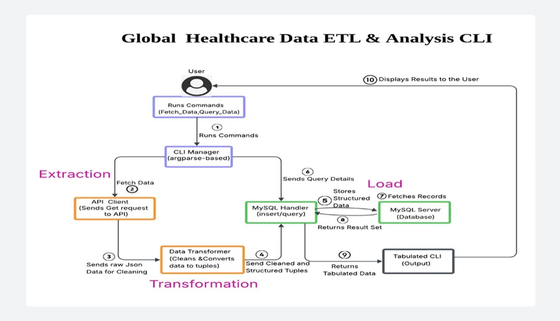

#  Global Healthcare Data ETL & Analysis CLI  
### Developed by: Vaka Sravanthi

##  Project Overview
Global Healthcare Data ETL & Analysis CLI is a Python-based command-line application designed to automate the full ETL (Extract, Transform, Load) process for COVID-19 historical data sourced from the disease.sh public API.

The system extracts real-time or historical data for a specified country and date range, cleans and structures it, and loads it into a MySQL database. Users can then perform a wide range of analytical queries—like tracking trends, viewing top affected countries, and generating global summaries—directly from a user-friendly CLI interface.

This tool is especially valuable for data engineers and analysts looking to work with reliable, structured healthcare data in a real-world data pipeline environment.

##  Problem Statement
Public APIs often return raw, unstructured, or inconsistent data. In the context of global healthcare monitoring, this leads to major challenges:
- Missing values and inconsistent formats
- Duplicate or redundant records
- Difficulty in querying and visualizing data for analysis

This project solves these issues by:
- Automatically extracting data via REST API
- Cleaning and structuring it using Python
- Storing it in a MySQL database for reliable access
- Allowing insights through a range of analytical CLI queries

## Skills and Technologies Used
# Programming Language:
    -Python – for scripting, data extraction, transformation, and CLI development

# Database:
   -MySQL – used for storing cleaned and structured data, and performing analytical queries

# API Source:
   -disease.sh – public API used to fetch historical COVID-19 data by country and date

# Python Libraries and Modules:
   -requests – for sending HTTP requests and handling API responses
   -mysql-connector-python – for connecting and interacting with the MySQL database
   -argparse – for handling command-line arguments and building the CLI
   -tabulate – for displaying query results in a well-formatted table in the terminal
   -configparser – for reading API and DB credentials from an external configuration file
   -logging – for tracking errors, operations, and debugging information

# Data Manipulation and Validation:
    -datetime – for working with and validating dates
    -Custom transformation functions – for cleaning, converting, and filtering raw API data
# Project Management:
    -Git – for version control and code tracking


###  System Architecture


##  File & Module Structure
```bash
healthcare_etl_cli/
├── main.py                     # CLI entry and command handler
├── api_client.py               # Handles data extraction from API
├── data_transformer.py         # Cleans and formats raw data
├── mysql_handler.py            # Connects to MySQL and performs operations
├── config.ini                  # Stores API and DB credentials
├── requirements.txt            # Project dependencies
├── sql/
│   └── create_tables.sql       # SQL schema file
├── data/
│   └── pics/
│       ├── ArchitectureDiagram.jpg     # System architecture image
│       ├── 1.jpg                       # CLI Output Screenshot 1
│       ├── 2.jpg                       # CLI Output Screenshot 2
│       ├── 3.jpg                       # CLI Output Screenshot 3
│       ├── 4.jpg                       # CLI Output Screenshot 4
│       ├── 5.jpg                       # CLI Output Screenshot 5
│       ├── 6.jpg                       # CLI Output Screenshot 6
│       ├── 7.jpg                       # CLI Output Screenshot 7
│       ├── 8.jpg                       # CLI Output Screenshot 8
│       ├── 9.jpg                       # CLI Output Screenshot 9
│       ├── 10.jpg                      # CLI Output Screenshot 10
│       └── 11.jpg                      # CLI Output Screenshot 11
└── README.md                   # Project documentation
```

##  Setup & Installation
 Follow the steps below to set up and run the project locally.
### Step 1. Clone the repository
Clone the project from GitHub using the following command:
```bash
git clone https://github.com/vaka-sravanthi/healthcare_etl_cli.git
cd healthcare_etl_cli
```
---
###  Step 2: Install Python Dependencies
Make sure Python 3.8 or higher is installed. Then install the required libraries:
```bash
pip install -r requirements.txt
```
---
###  Step 3: Configure the Project

Update the `config.ini` file with your MySQL and API settings:

```ini
[mysql]
host = localhost
user = root
password = your_password
database = healthcare_db

[api]
url = https://disease.sh/v3/covid-19/historical
```

---
### Step 4: Set Up the MySQL Database

Ensure MySQL is running. Then execute the following to create the required table:

```bash
mysql -u root -p < sql/create_tables.sql
```

Or manually execute the SQL from `create_tables.sql` in your MySQL client.

Create table if not exists covid_stats (
    id int auto_increment primary key,
    country varchar(100) not null,
    date Date not null,
    cases int,
    deaths int,
    recovered int,
    last_updated timestamp default current_timestamp,
    unique (country, date)
);


---
###  Step 5: Run the Application
Now you're ready to use the CLI application.
#### Example1: Fetch Data
```bash
python main.py fetch_data <country> <start_date> <end_date>
```

```bash
python main.py fetch_data India 2023-01-01 2023-01-10
```

#### Example2: List Tables
```bash
python main.py list_tables
```

#### Example3: Run Query
## Data Query Commands

```bash
python main.py query_data <query_type> [--country <country>] [--metric <metric>] [--n <number>]
```

```bash
python main.py query_data top_n_countries_by_metric --metric deaths --n 5
```
### Example4: Drop specific table
```bash
python main.py drop_table covid_stats
```

---
### Example5: Drop all tables
```bash
python main.py drop_tables
```

### Query Types:
- `total_cases`
- `daily_trends`
- `top_n_countries_by_metric`
- `global_summary`
- `countries_with_zero_deaths`
- `most_critical_cases`
- `recovered_rate_over_50`
- `show_all_for_country`

---
## Sample Output

## Testing Checklist
- API fetch 
- Data cleaning 
- Batch insert 
- CLI queries 
- Argument validation 
- Error logging

##  References

- [disease.sh API](https://disease.sh/v3/covid-19/historical)
- [MySQL Connector](https://dev.mysql.com/doc/connector-python/en/)
- [Tabulate](https://pypi.org/project/tabulate/)

---


###  Setup Complete
You are now ready to explore and analyze global healthcare data using the CLI!

## License
This project is for academic use only. All rights reserved © 2025 Vaka Sravanthi.


